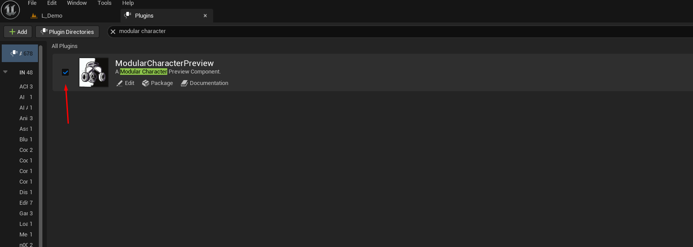
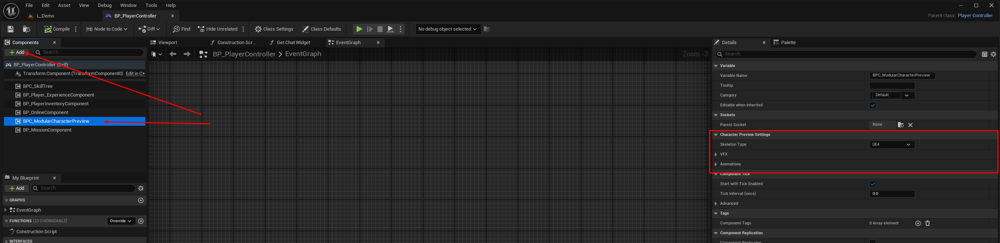
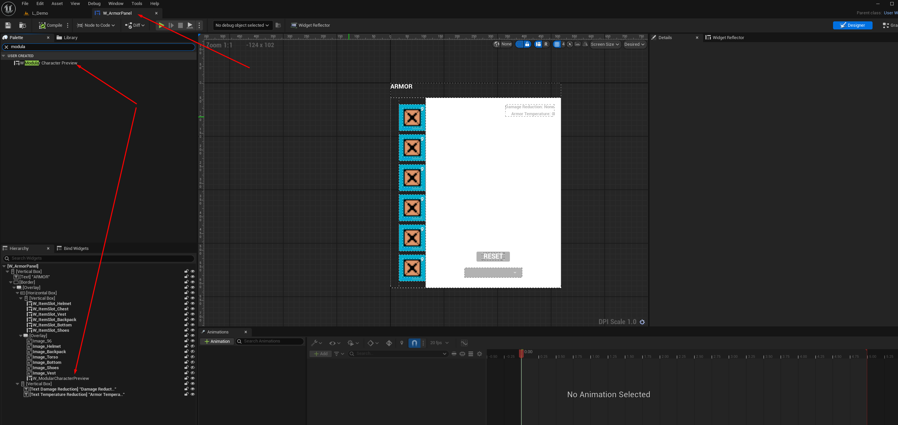
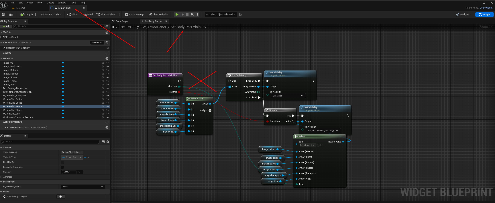

# Installation

1. Enable the plugin in your project.

2. Add `BPI_ModularCharacterPreview` to your character and implement `GetMeshes`.

3. Add the `BPC_ModularCharacterPreview` component to your Player Controller.

4. Add `W_ModularCharacterPreview` to your UI widget (inventory, equipment, etc.).

5. In the widget, disconnect the static preview texture binding so the runtime RenderTarget can be assigned.

Notes:
The `GetMeshes` output should return Main Mesh, Follower Meshes array, Face Mesh, and Groom Components array.
